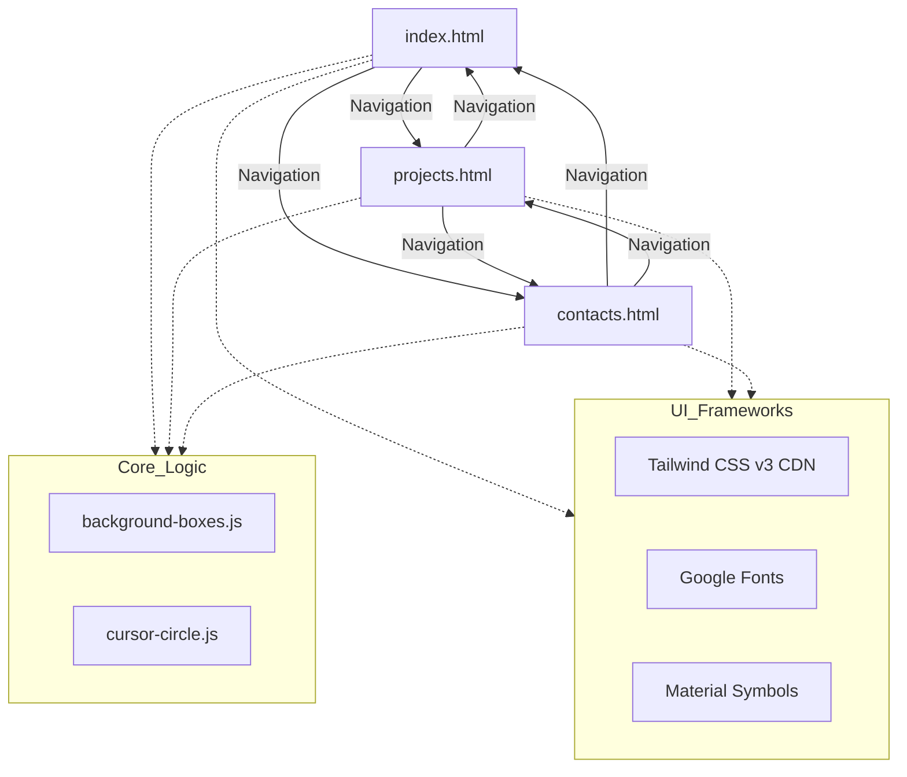

# Architecture

> Auto-generated by /map on 2026-04-13

## Overview

A sophisticated static portfolio website for "ari-tive" (Alex Rivers), featuring a modern aesthetic with interactive elements. The site consists of a home page, project showcase, and contact page, built with a focus on premium user experience and responsiveness.

## Components

### Main Navigation
- **Purpose**: Unified header for cross-page navigation.
- **Location**: Included in `index.html`, `projects.html`, and `contacts.html`.
- **Features**: Glassmorphism effect (`nav-blur`), active state highlighting, and a responsive hamburger menu for mobile devices.

### Landing Page (Home)
- **Purpose**: Introduction and value proposition.
- **Location**: `website/index.html`
- **Features**:
  - **Hero Section**: High-impact typography with a dynamic typewriter/slider tagline effect.
  - **About Me**: Brief background on web and Minecraft server development.
  - **Core Services**: Specialization cards for Web Development and Minecraft Solutions.
  - **Why Choose Me**: Benefits list with custom iconography.

### Projects Showcase
- **Purpose**: Displays a curated collection of work.
- **Location**: `website/projects.html`
- **Features**: Detailed cards for "EveMC Network" and "Cafe Velvet" with descriptions, tags, and external "Visit" links.

### Contact Page
- **Purpose**: Communication channels and location.
- **Location**: `website/contacts.html`
- **Features**:
  - **Contact Cards**: Email, Instagram, Discord, and GitHub entries.
  - **Interactivity**: "Copy to Clipboard" functionality with visual feedback (toast).
  - **Map**: Embedded Google Maps view of Mumbai, Maharashtra.

### Interactive Effects
- **Background Grid**: `website/background-boxes.js` creates a dynamic, reactive grid of boxes that light up on cursor move.
- **Custom Cursor**: `website/cursor-circle.js` adds a circular follow-ring and manages "Copied!" toast notifications.

## Data Flow
- **Static Content**: All data (projects, contact info, about text) is currently hardcoded in the HTML files.
- **Client-side Interaction**: DOM events (clicks, mouse moves) drive the interactive animations and mobile menu state.

## Integration Points

| Service | Type | Purpose |
|---------|------|---------|
| Google Fonts | Web Font API | Typography (Manrope & Playfair Display) |
| Material Symbols | Icon Font | UI Iconography |
| Vercel | Hosting | Automated deployment and pretty URLs |
| Google Maps | Iframe | Location visualization |

## Technical Debt

- [ ] **Redundant Code**: Mobile menu logic and navigation HTML are duplicated across three files.
- [ ] **Placeholder Files**: `styles.css` and `script.js` are empty and could be used to consolidate shared CSS/JS.
- [ ] **Hardcoded Data**: Project and contact data should be moved to a JSON file or managed through a CMS for easier updates.
- [ ] **inline Scripts**: Tagline animation and menu logic are inline in HTML files, hindering cacheability.

## Conventions

- **Naming**: Elements are grouped by `data-purpose` attributes (e.g., `data-purpose="hero-section"`).
- **Styling**: Utility-first CSS using Tailwind CDN, complemented by embedded `<style>` blocks for complex layouts and animations.
- **Theme**: Consistent "Brand Cream" (#F9F7F2) background and "Brand Dark" (#3D3A35) text with "Brand Primary" (#ec6d13) accents.
